# MU Server Workflows (10k CCU, single bare metal first)

## Escopo
Este documento descreve os principais casos de uso da arquitetura proposta para MU Online com foco em:
- ate 10k usuarios concorrentes
- capacidade de rodar em 1 servidor bare metal
- evolucao gradual para multi-host sem quebrar contratos internos
- prioridade de gameplay de characters sobre AI de monstros
- reducao de hit em banco via buffer + flush periodico

## Contexto de dominio
- Um `World` (ex.: Midgard) possui multiplos `EntryPoint` (ex.: Midgard-1, Midgard-2).
- Cada `EntryPoint` possui varios `MapServer` (1 processo/logica por mapa, com instancias quando necessario).
- O estado de gameplay e autoritativo no `MapServer`.
- Persistencia critica e sincrona; persistencia nao critica usa buffering e flush em lote.

## Componentes logicos
- `Gateway`: login, sessao, roteamento para world/entry.
- `WorldDirectory`: catalogo de worlds, entry points, lotacao e health.
- `MapServer`: simulacao de players e regras de mapa.
- `MonsterWorker` (opcional): processa AI pesada para mapas quentes.
- `MessageHub`: chat/eventos cross-map e cross-entry.
- `PersistenceWorker`: coalescing de estado nao critico + batch writes.
- `WAL`: journal local para eventos criticos.
- `Database`: armazenamento persistente (contas, chars, inventario, transacoes).

## Casos de uso e workflows

### UC-01 - Boot da stack em single bare metal
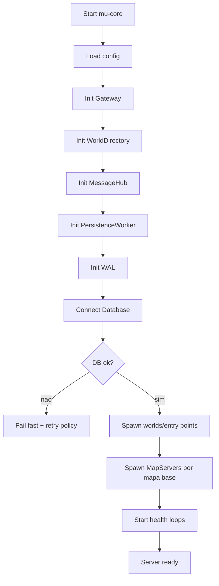

### UC-02 - Login com sessao unica por conta
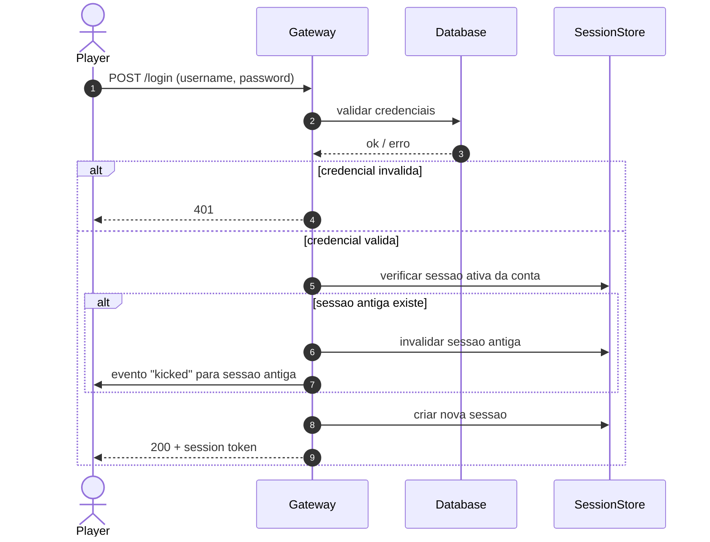

### UC-03 - Descoberta de World e EntryPoint
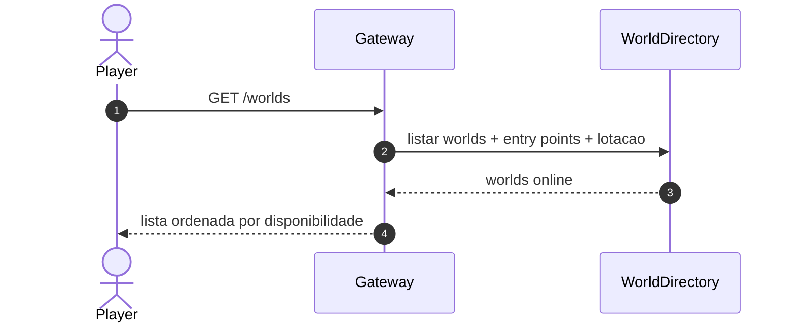

### UC-04 - Selecao de character e entrada no mapa inicial
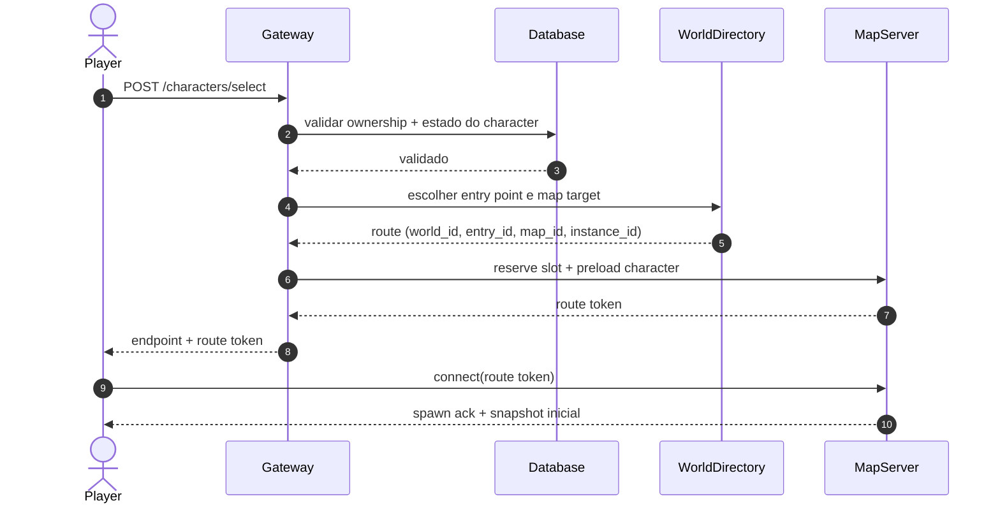

### UC-05 - Tick de gameplay com prioridade de player
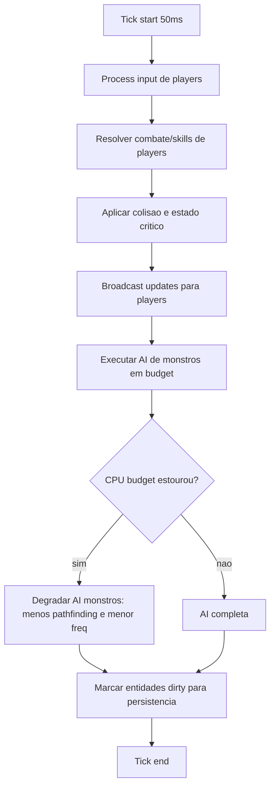

### UC-06 - AI de monstros no mesmo processo (padrao)
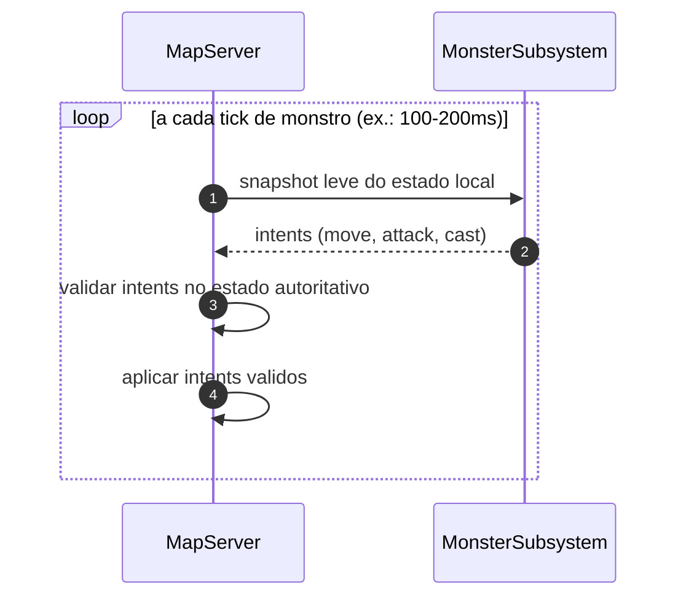

### UC-07 - AI de monstros em worker separado (opcional)
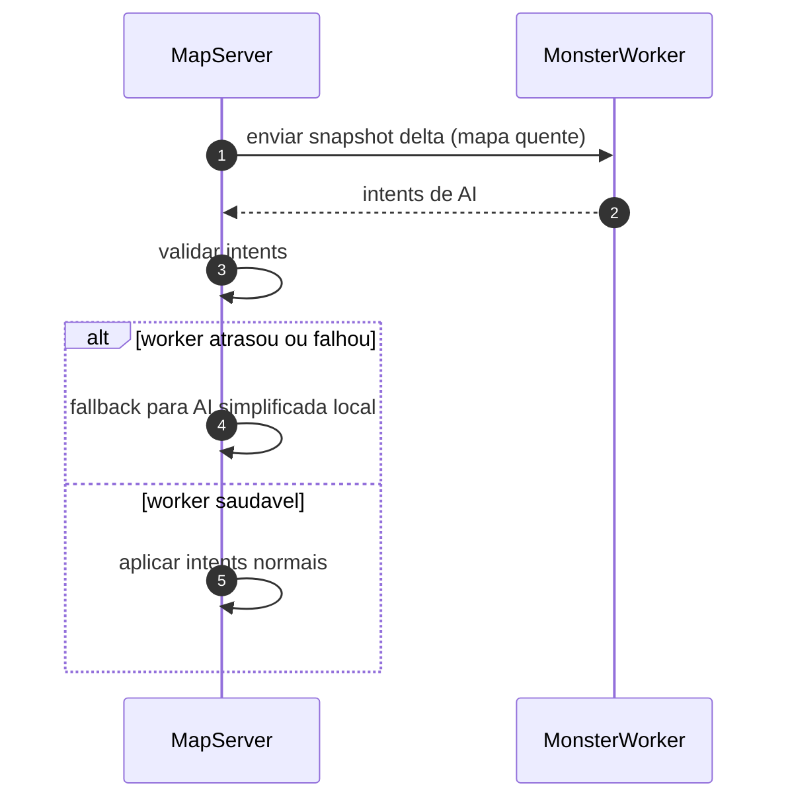

### UC-08 - Troca de mapa (intra-world)
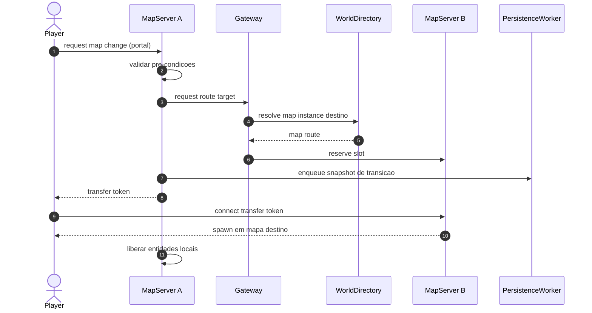

### UC-09 - Chat local, party, guild e global
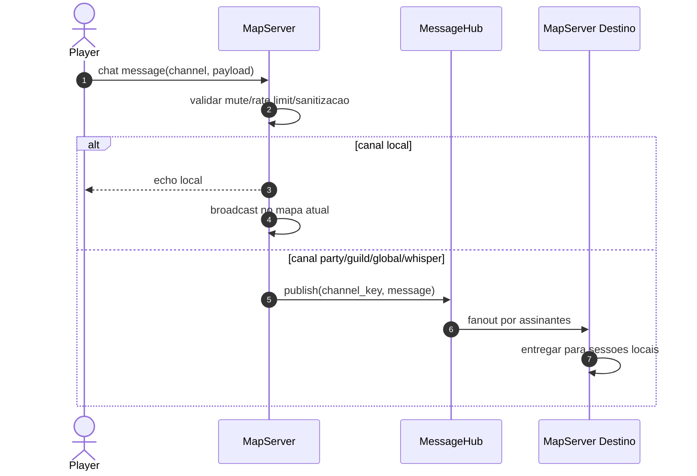

### UC-10 - Persistencia nao critica com buffer e flush
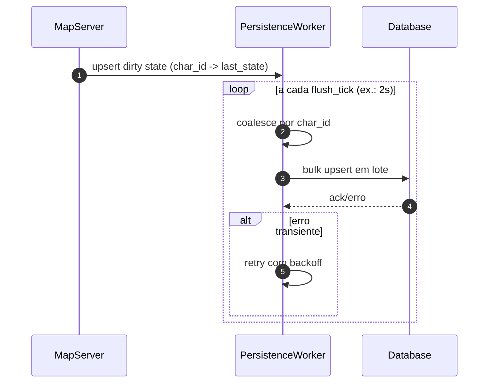

### UC-11 - Operacao critica (trade/inventario/zen/cash)
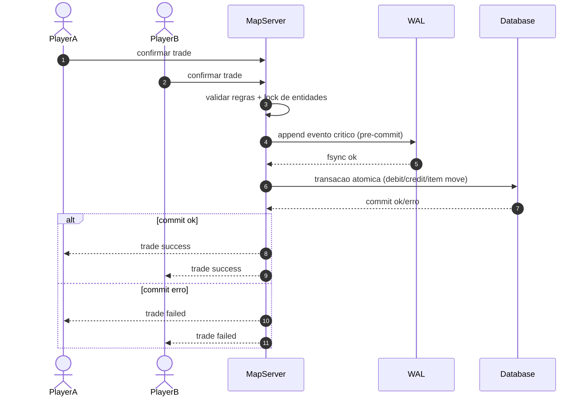

### UC-12 - Recuperacao apos crash (WAL replay)
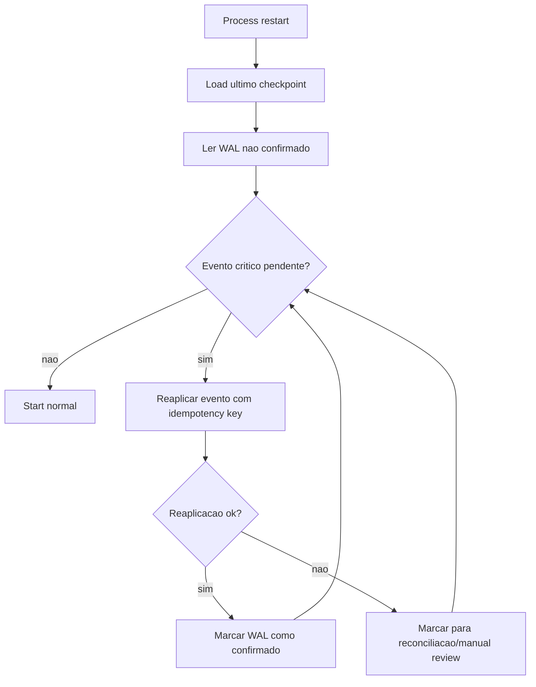

### UC-13 - Logout e desconexao inesperada
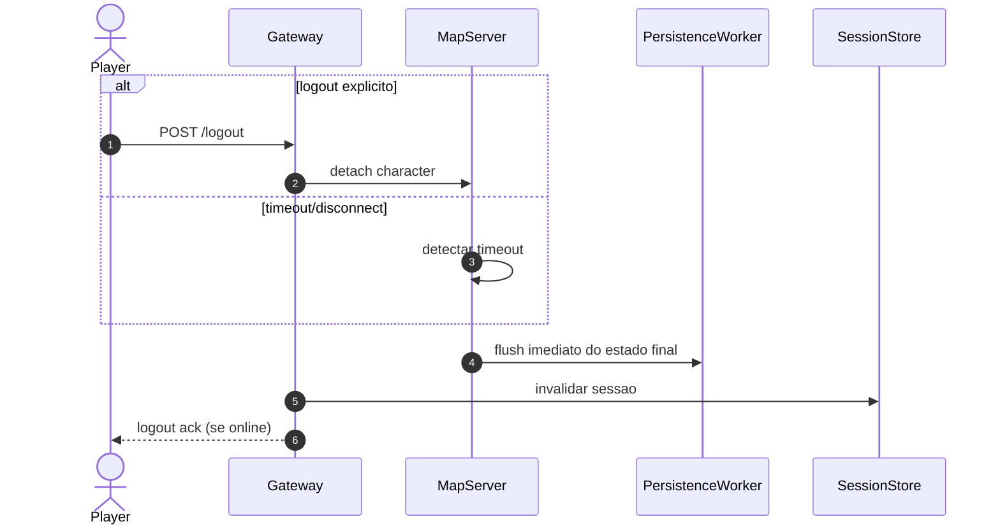

### UC-14 - Shutdown gracioso
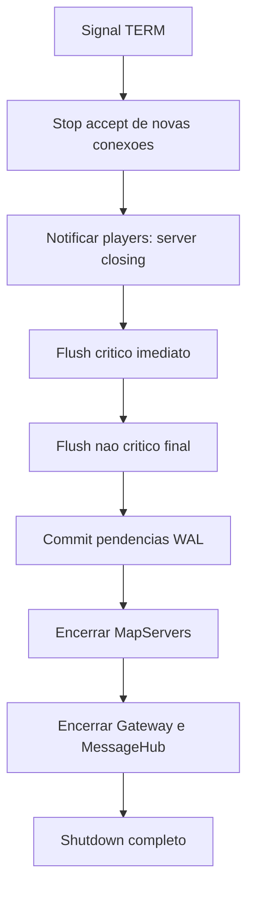

### UC-15 - Protecao de sobrecarga por mapa
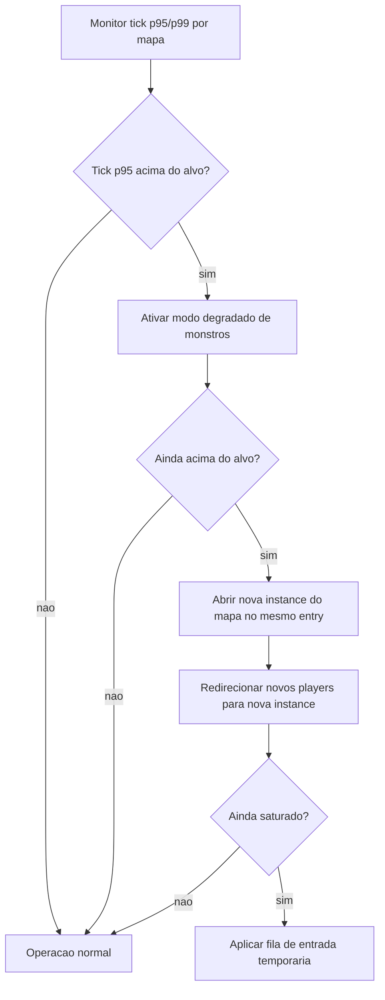

### UC-16 - Pipeline QUIC de ponta a ponta
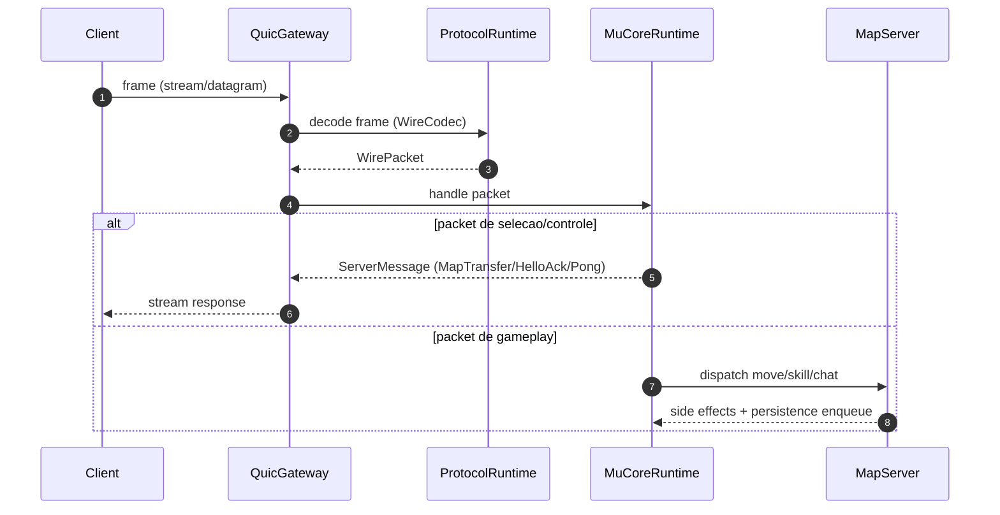

### UC-17 - Auto-scale de instance por mapa (on-demand)
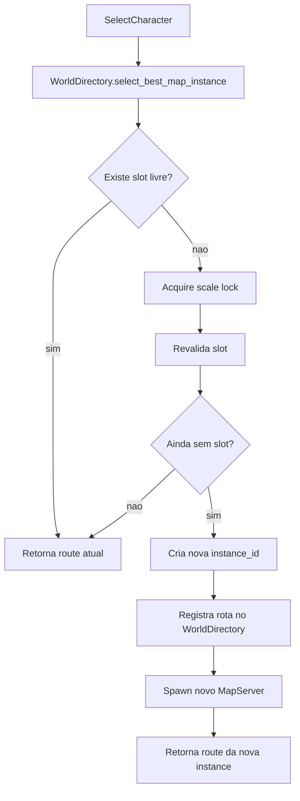

## Contratos de consistencia
- Forte consistencia (sincrono): inventario, trade, zen/cash, rewards raras.
- Eventual consistencia (buffer + flush): posicao, hp/mp periodico, cooldown snapshot, estado de mapa.
- Idempotencia obrigatoria: todo evento critico tem `event_id` unico e reprocessavel.

## Parametros iniciais sugeridos
- `player_tick`: 50ms (20Hz)
- `monster_tick`: 100-200ms (5-10Hz)
- `flush_tick`: 2s
- `max_flush_lag`: 10-15s
- `batch_size`: 200-500 registros
- `map_ccu_soft_cap`: 250-350 players por instancia de mapa

## Evolucao sem quebra de arquitetura
1. Comecar com 1 binario (`mu-core`) no bare metal com modulos internos.
2. Extrair `MessageHub` para processo separado quando trafego de chat crescer.
3. Extrair `MonsterWorker` por mapas quentes quando AI virar gargalo.
4. Extrair `Gateway` para replicas stateless quando escalar para multi-host.
