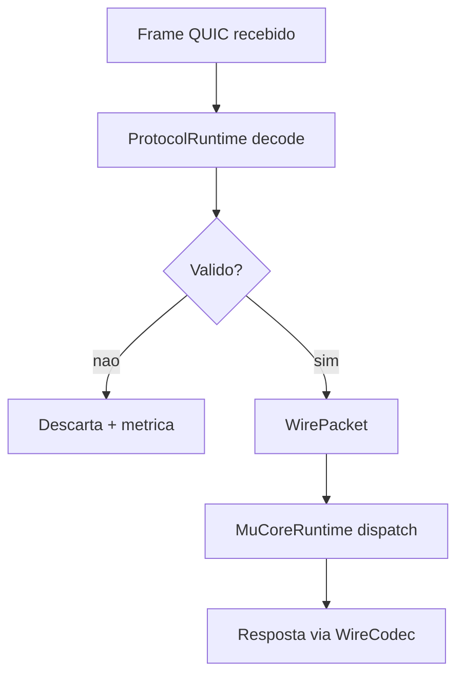

# Protocol Migration Roadmap (Finalizado: v2 QUIC)

## Objetivo
Registrar o estado final da migracao do protocolo para `protocol v2` com QUIC e serializacao binaria tipada.

## Status atual
- `protocol v2` ativo por padrao no workspace.
- `server` opera com pipeline unica:
  - `WireCodec` para stream/datagram.
  - `ProtocolRuntime` para decode e resposta baseline.
  - `MuCoreRuntime` para dispatch de gameplay.
- Gateway QUIC integrado ao bootstrap do servidor.
- Auto-scale de instancia de mapa ativo por `soft_player_cap`.

## Codigo legado removido
- Removido do crate `protocol`:
  - `header.rs`
  - `packets.rs`
  - `ser.rs`
  - `de.rs`
  - `migration.rs`
- Removido do crate `server`:
  - `protocol_bridge.rs`
  - feature `legacy-protocol-adapter`

## Workflow atual (servidor)

## Validacoes recomendadas
- `cargo test --workspace`
- `cargo test --manifest-path server/Cargo.toml`
- `cargo test --manifest-path protocol/Cargo.toml`

## Proximos passos
- Evoluir contratos de mensagem com versionamento semantico (`2.x`).
- Adicionar testes de compatibilidade entre builds de client/server v2.
- Consolidar SLOs por canal QUIC (latencia, perda em datagram, retries em streams).
