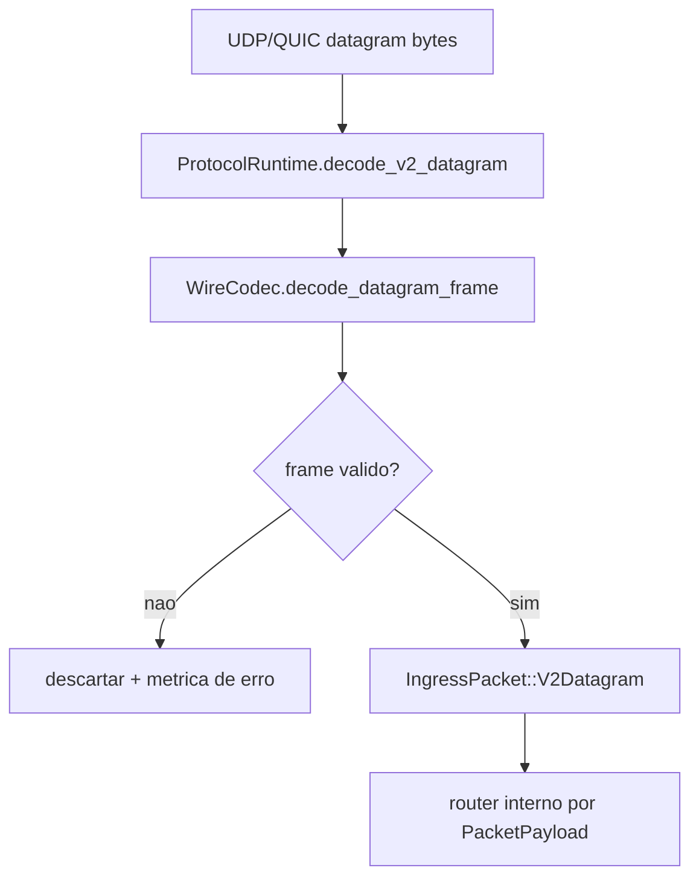
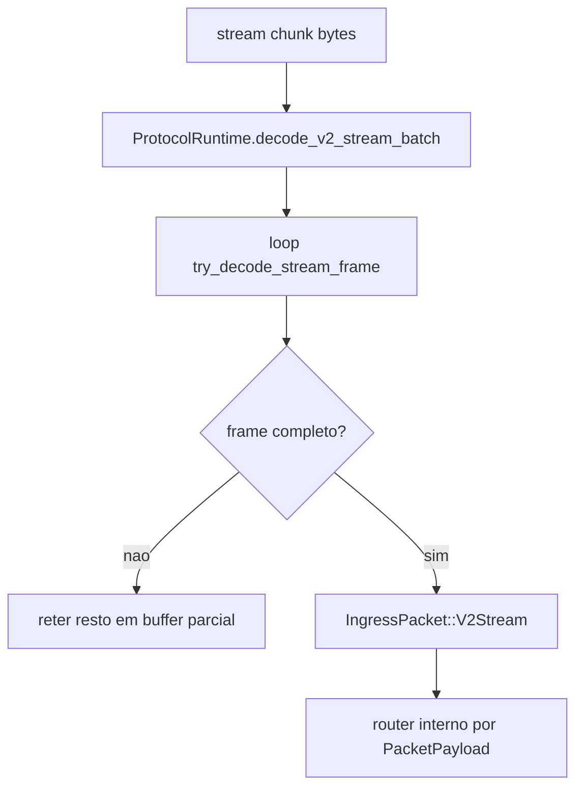
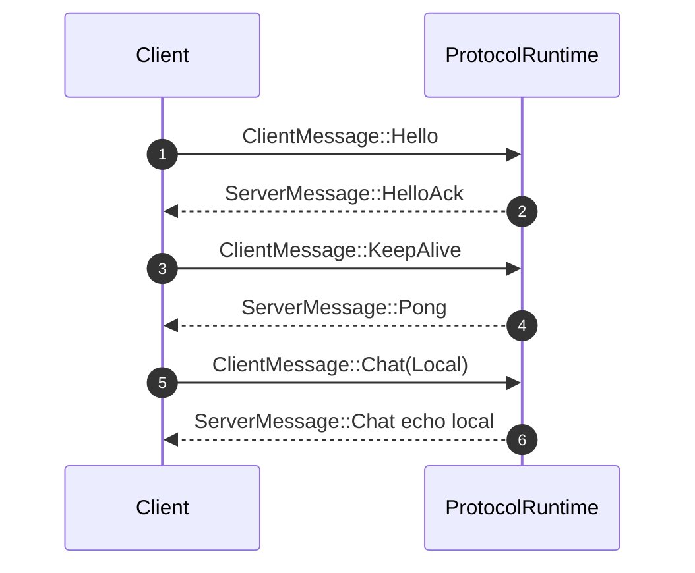

# Protocol Runtime Workflows (Server)

## Objetivo
Definir a pipeline de ingestao de pacotes no servidor durante a migracao, padronizando tudo em `WirePacket` antes da camada de gameplay.

## Componentes
- `ProtocolRuntime`: decode/normalizacao de pacotes (`server/src/protocol_runtime.rs`)
- `WireCodec`: decode/encode v2 para datagram e stream (`protocol/src/codec.rs`)

## Workflow: ingestao v2 por datagram

## Workflow: ingestao v2 por stream

## Workflow: resposta baseline no controle

## Regras atuais do baseline response
- `Hello` -> `HelloAck` (MOTD + heartbeat interval)
- `KeepAlive` -> `Pong`
- `Chat(Local)` -> echo local
- demais mensagens: sem resposta baseline (delegadas para handlers de gameplay)

## Integracao recomendada
1. Socket QUIC recebe bytes por canal.
2. `ProtocolRuntime` converte para `IngressPacket`.
3. Dispatcher converte `IngressPacket` para `WirePacket`.
4. Gameplay/Session handlers processam `WirePacket`.
5. Respostas passam por `WireCodec` e retornam ao cliente no canal correto.

## Implementacao atual no repositorio
- Ingress QUIC: `server/src/runtime/quic_gateway.rs`
- Decode stream/datagram: `MuCoreRuntime::handle_stream_bytes` e `MuCoreRuntime::handle_datagram_frame`
- Dispatch de gameplay: `MuCoreRuntime::handle_client_packet`
- Escalonamento de mapas: `MuCoreRuntime::resolve_or_scale_map_route`
