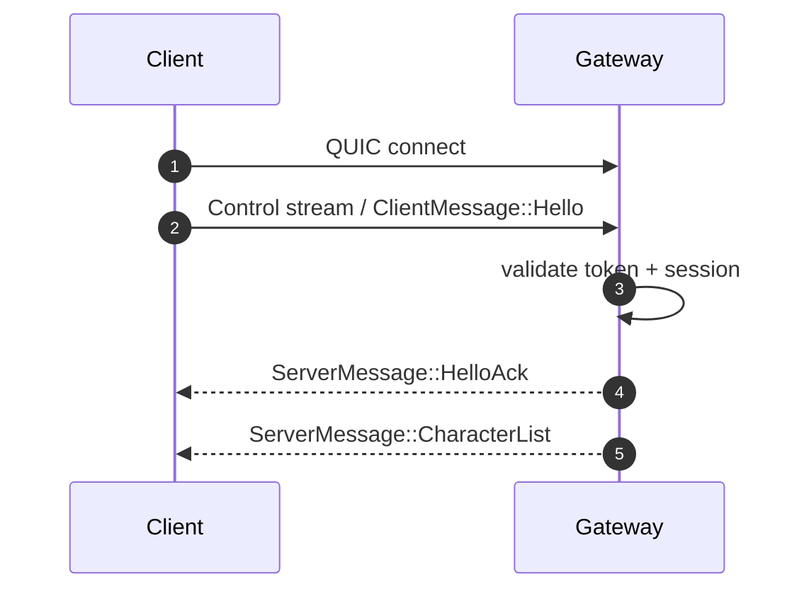
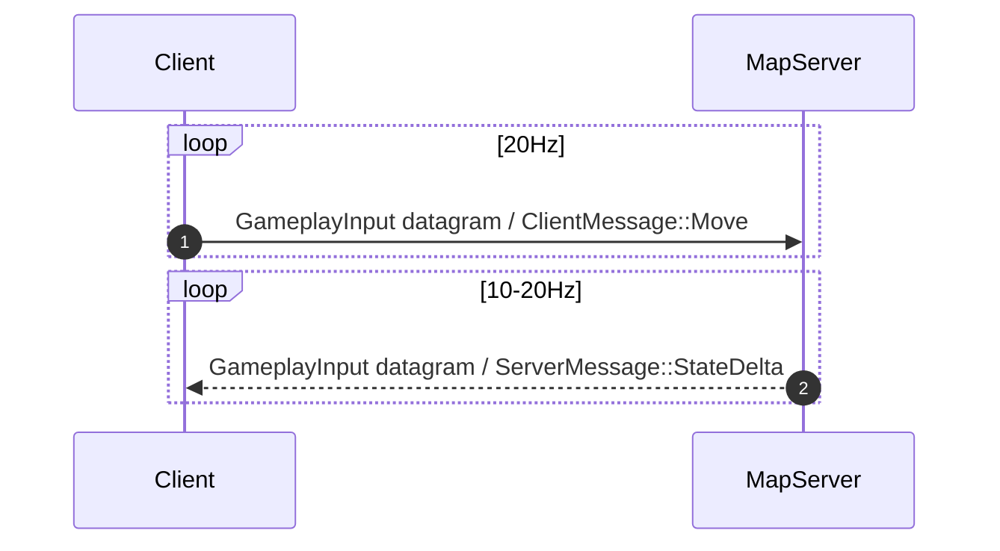
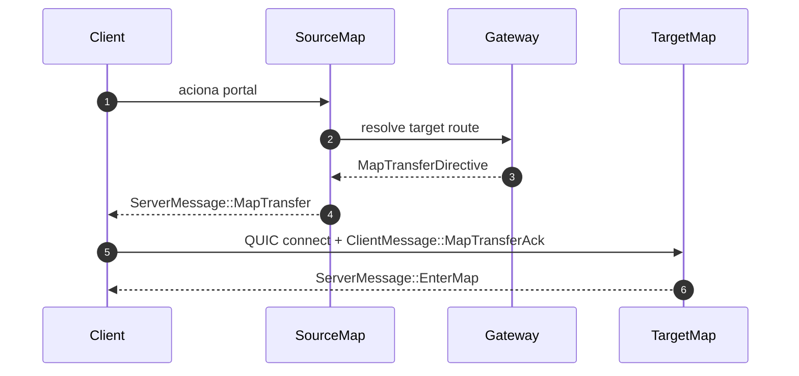
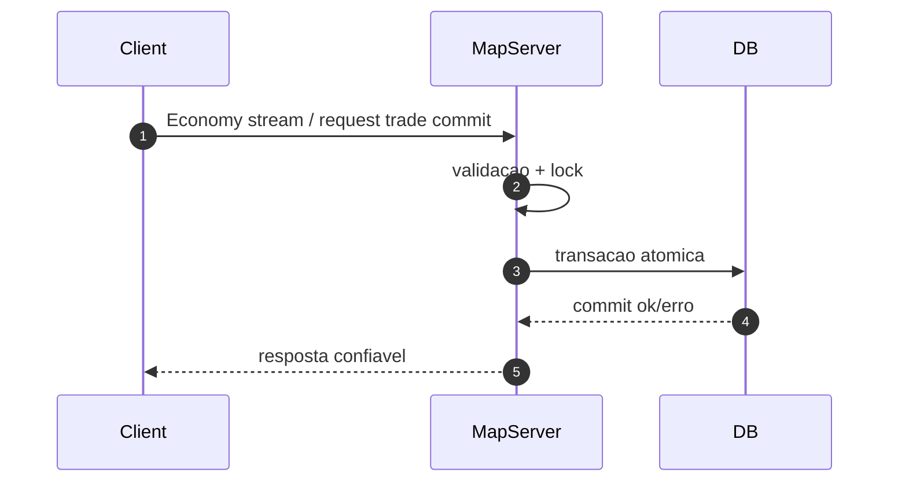

# Protocol v2 (QUIC + binary serialization)

## Objetivo
Substituir o protocolo legado baseado em layout C++ por um protocolo versionado e tipado para o ecossistema MU (client, gateway e game servers), com foco em:
- simplicidade para single bare metal
- evolucao sem quebra para multi-host
- gameplay prioritario
- economia e inventario com entrega confiavel

## Decisoes de base
- Transporte: `QUIC`
- Serializacao: `postcard` (binario compacto via `serde`)
- Envelope: `WireEnvelope<T>` com `version`, `route`, `session_id`, `sequence`, `ack`, `sent_at_ms`
- Payload: `PacketPayload::{Client,Server}`

## Canais QUIC
| Channel | Id | Transporte | Garantia | Uso |
|---|---:|---|---|---|
| Control | 0 | Bidi Stream | Reliable Ordered | hello, keepalive, seleção de character, transfer |
| Chat | 1 | Bidi Stream | Reliable Ordered | local/party/guild/global/whisper |
| GameplayInput | 2 | Datagram | Unreliable | movimento e state delta frequente |
| GameplayEvent | 3 | Bidi Stream | Reliable Ordered | skill/action importantes |
| Economy | 4 | Bidi Stream | Reliable Ordered | trade, inventário, zen/cash |

## Framing
### Datagram frame
- `byte[0]`: `channel_id`
- `byte[1..]`: payload `postcard` (`WirePacket`)

### Stream frame
- `byte[0..2]`: magic `MU`
- `byte[2]`: `channel_id`
- `byte[3..7]`: `payload_len` (u32 little-endian)
- `byte[7..]`: payload `postcard` (`WirePacket`)

## Regras de validacao
- Toda mensagem deve ter `version == PROTOCOL_VERSION`.
- `channel_id` deve ser compativel com o tipo de payload.
- Mensagens acima dos limites de codec devem ser rejeitadas.

## Workflow: handshake inicial

## Workflow: gameplay loop (movimento)

## Workflow: troca de mapa

## Workflow: operacao critica (economia)

## Limites iniciais sugeridos
- `max_datagram_size`: 1200 bytes
- `max_stream_payload_size`: 64 KiB
- `PROTOCOL_VERSION`: `2.0`

## Status de implementacao no crate
- API de mensagens: `protocol/src/message.rs`
- Definicao de canais: `protocol/src/channel.rs`
- Codec + framing + validacao: `protocol/src/codec.rs`

## Status de implementacao no server
- Runtime unificado de pacote: `server/src/protocol_runtime.rs`
- Core de world/entry/map: `server/src/runtime/core.rs`
- Gateway QUIC ativo no bootstrap: `server/src/runtime/quic_gateway.rs`
- Auto-scale on-demand de instancia por mapa: `MuCoreRuntime::resolve_or_scale_map_route`
- Observabilidade runtime por HTTP:
  - `GET /runtime/worlds`
  - `GET /runtime/maps`
  - `GET /runtime/persistence`
  - `GET /runtime/stats`

## Migracao incremental
- Plano por fases: `docs/architecture/protocol-migration-roadmap.md`
- Runtime de ingestao no servidor: `docs/architecture/protocol-runtime-workflows.md`
- Status atual: stack legado removida, gateway opera apenas com `WireCodec` + `WirePacket`.
